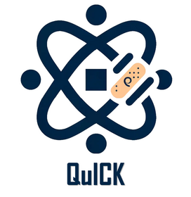

# QuICK

Quantum Integrity and Correction Kit (QuICK) is a quantum error correction package in the QuAIR team (under construction). The tools are for code construction and decoding.

<p align="center">
  
</p>

## Features

- `QuICK`: contain error correction codes include:
  - `code`: classical and quantum code construction
    - `ClassicalCode`: binary classical linear block code
    - `Stabilizer:` quantum stabilizer code
    - `CSSCode`: quanutm Calderbank-Shor-Steane(CSS) code
    - `HGP`: quantum hypergraph product code
    - `LP`: quantum lifted product code
  - `utils`: binary linear algebra and code utilities
  - `dataset`: commonly used classical and quantum codes
  - `error`: simple Pauli error
  - `decoder`: code decoder
    - `bp_decoder`: belief propagation sum-product decoder
- `tutorial`: tutorials for quantum error correction

## Installation

Set up Anaconda environment

```bash
conda create -n quair python=3.10
conda activate quair
conda install jupyter notebook
```

Install QuICK locally

```bash
cd ./< your place for QuICK >
pip install -e .
```

## Tutorials

- Error Correction Codes
  - [CSS Code](./tutorials/code/CSS%20code%20tutorial.ipynb)
  - [Hypergraph Product Code](./tutorials/code/Hypergraph%20Product%20Code%20tutorial.ipynb)
  - [Lifted Product Code](./tutorials/code/Lifted%20Product%20Code%20tutorial.ipynb)
  - [Stabilizer Code](./tutorials/code/Stabilizer%20Code%20tutorial.ipynb)
- Error Correction Decoders
  - [Belief Propagation Decoder](./tutorials/decoder/belief_propagation_demo.ipynb)
  - [How to use Pymatching](./tutorials/decoder/pymatching_decoder_demo.ipynb)
